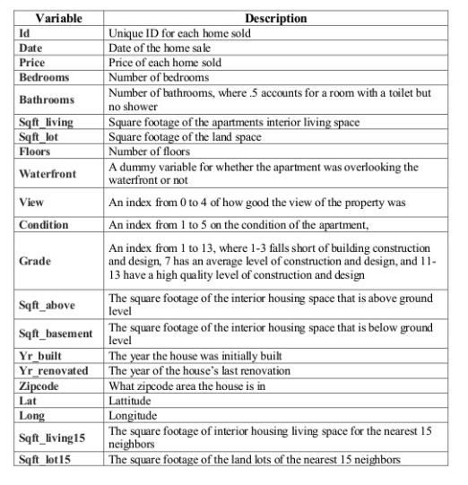

```{r setup, include=FALSE}
knitr::opts_chunk$set(echo = FALSE)
```


Laad `tidyverse`, `tidymodels` en enkele andere pakketten en zet `theme` (optioneel) voor een bepaalde vormgeving van de figuren.

```{r libraries}
library(tidyverse)         # for reading in data, graphing, and cleaning
library(tidymodels)        # for modeling
library(lubridate)         # for date manipulation
library(moderndive)        # for King County housing data
library(vip)               # for variable importance plots
theme_set(theme_minimal()) # my favorite ggplot2 theme :)
```

Lees de King County Housing-data in en kijk eens naar de eerste vijf rijen.

```{r data}
data("house_prices")

house_prices %>% 
  slice(1:5)
```


Over de `house_prices` data lezen we het volgende:    

> "Deze dataset bevat huizenverkoopprijzen voor King County, waar Seattle deel van uitmaakt. Het omvat huizen verkocht tussen mei 2014 en mei 2015. Deze dataset is verkregen via [Kaggle.com](https://www.kaggle.com/harlfoxem/housesalesprediction/data)." De beschrijving van de variabelen in de dataset in de documentatie lijkt niet helemaal te kloppen. Een meer accurate beschrijving is hieronder te vinden. In ieder geval willen we hier de prijs van woningen modelleren. 


{width=400px}

# Exploratie

Kijk eerst eens naar de verdelingen van alle variabelen om te zien of er iets onregelmatigs aan de hand is.

Kwantitatieve variabelen:

```{r expl_quant, fig.width=6, fig.height=4}
house_prices %>% 
  select_if(is.numeric) %>% 
  pivot_longer(cols = everything(),names_to = "variable", values_to = "value") %>% 
  ggplot(aes(x = value)) +
  geom_histogram(bins = 30) +
  facet_wrap(vars(variable), scales = "free")
```

Dingen die opvielen en eerste gedachten over het opstartproces:
* 'Right-skewness' in de variabele `price` en alle variabelen betreffende vierkante meters --> log transformeren indien lineaire regressie wordt gebruikt.
* Veel 0's in `sqft_basement`, `view`, en `yr_renovated` --> maak indicator variabelen van het hebben van dat kenmerk vs. niet hebben , dat wil zeggen een variabele genaamd `basement` waar een 0 aangeeft geen kelder (`sqft_basement` = 0) en wel een kelder bij (`sqft_basement` > 0).  
* Leeftijd van huis is misschien een betere, interpreteerbare variabele dan bouwjaar --> `age_at_sale = year(date) - yr_built`.

```{r expl_cat}
house_prices %>% 
  select_if(is.factor) %>% 
  pivot_longer(cols = everything(),names_to = "variable", values_to = "value") %>% 
  ggplot(aes(x = value)) +
  geom_bar() +
  facet_wrap(vars(variable), scales = "free", nrow = 2)
```


# Data splitsen (in train- en test-sets)

Eerst splitsen we de gegevens op in training- en test-datasets.  We gebruiken de trainingsgegevens om verschillende soorten modellen te proberen en de parameters van die modellen zo nodig aan te passen. De testdataset wordt bewaard voor het allerlaatst om een kleine subset van modellen te vergelijken. De `initial_split()` functie uit de `rsample` bibliotheek (onderdeel van `tidymodels`) wordt gebruikt om tot deze splitsing te komen. We splitsen deze dataset random, maar er zijn andere mogelijkheden om tot gestratificeerde steekproeven te komen. Daarna gebruiken we `training()` en `testing()` om de twee datasets, `house_training` en `house_testing`, te extraheren. 

```{r init_split}
set.seed(327) #voor reproduceerbaarheid

# Randoml toewijzen van 75% van de data aan training.
house_split <- initial_split(house_prices, 
                             prop = .75)
house_split
#<training/testing/totaal>

house_training <- training(house_split)
house_testing <- testing(house_split)
```

Later zullen we 5-voudige cross-validatie gebruiken om het model te evalueren en de modelparameters aan te passen. We zetten de vijfvoud van de trainingsdata op met de `vfold_cv()` functie. We zullen dit later in meer detail uitleggen.

```{r cv}
set.seed(1211) # voor reproduceerbaarheid
house_cv <- vfold_cv(house_training, v = 5)
```


# Data voorspel: `recipe()` en `step_xxx()`

* We gebruiken de `recipe()`-functie om de uitkomstvariabele en de predictoren te definiëren. 

* Een verscheidenheid van `step_xxx()` functies kan worden gebruikt om data te bewerken/transformeren. Vind ze allemaal [hier](https://www.tidymodels.org/find/recipes/). Ik heb er een paar gebruikt, met korte beschrijvingen in de code. Ik heb ook een aantal selectiefuncties gebruikt, zoals `all_predictors()` en `all_nominal()` om de juiste variabelen te selecteren.

* We gebruiken ook `update_roles()` om de rollen van sommige variabelen te veranderen. Voor ons zijn dit variabelen die we misschien willen meenemen voor evaluatiedoeleinden, maar die niet gebruikt zullen worden bij het bouwen van het model. Ik heb gekozen voor de rol `evaluative`, maar je kunt die rol elke naam geven die je maar wilt, bijvoorbeeld `id`, `extra`, `junk` (misschien een slecht idee?).

```{r recipe}
house_recipe <- recipe(price ~ ., #short-cut, . = alle andere variabelen
                       data = house_training) %>% 
  # Voorspel:
  # Wehalen overbodige variabelen sqft_living en sqft_lot
  step_rm(sqft_living15, sqft_lot15) %>%
  # log sqft variabelen & price
  step_log(starts_with("sqft"),-sqft_basement, price, 
           base = 10) %>% 
  # nieuwe grade variabele combineert lage & hoge graden
  # indicator variabelen voor basement, renovate, en view 
  # waterfront naar numeriek
  # leeftijd van het huis aanmaken (age_at_sale)
  step_mutate(grade = as.character(grade),
              grade = fct_relevel(
                        case_when(
                          grade %in% "1":"6"   ~ "below_average",
                          grade %in% "10":"13" ~ "high",
                          TRUE ~ grade
                        ),
                        "below_average","7","8","9","high"),
              basement = as.numeric(sqft_basement == 0),
              renovated = as.numeric(yr_renovated == 0),
              view = as.numeric(view == 0),
              waterfront = as.numeric(waterfront),
              age_at_sale = year(date) - yr_built)%>% 
  # Weghalen sqft_basement, yr_renovated en yr_built
  step_rm(sqft_basement, yr_renovated, yr_built) %>% 
  # Creëer een maandvariabelen
  step_date(date, features = "month") %>% 
  # Maak deze evaluatieve variabelen, die niet bij het  modeleren worden gebruikt
  update_role(all_of(c("id","date","zipcode", 
                       "lat", "long")),
              new_role = "evaluative") %>% 
  # Creëer indicator variabelen voor factors/character/nominal
  step_dummy(all_nominal(), all_predictors(), 
             -has_role(match = "evaluative"))
```

Pas het toe op de trainings-dataset, gewoon om te zien wat er gebeurt. Let op de namen van de variabelen.


```{r apply_recipe}
house_recipe %>% 
  prep(house_training) %>%
  juice() 
```

# Het model definiëren en workflows creëren

Nu we de gegevens hebben opgesplitst en voorbewerkt, zijn we klaar om te modelleren! Eerst zullen we `price` (die nu eigenlijk *log(price)* is) modelleren met eenvoudige lineaire regressie.

We zullen dit doen met behulp van enkele modelleringsfuncties uit het `parsnip` pakket. Vind alle beschikbare functies [hier](https://www.tidymodels.org/find/parsnip/). [Hier](https://parsnip.tidymodels.org/reference/linear_reg.html) is lineaire regressie meer in detail.


Om ons model te definiëren, moeten we de volgende stappen zetten:

* Bepaal het modeltype, dat is het algemene moeltype dat u wilt draaien.    
* Stel de motor in, die het pakket/de functie bepaalt die zal worden gebruikt om het model te draaien.  
* Stel de modus in, die ofwel "regressie" is voor continue uitkomstvariabelen of "classificatie" voor binaire/categorische uitkomstvariabelen. (Merk op dat voor lineaire regressie, het alleen "regressie" kan zijn, dus we hebben deze stap in dit geval niet NODIG).  
* (OPTIONEEL) Stel argumenten in om af te stemmen ('tunen'). We zullen hier later een voorbeeld van zien.

```{r linear_mod}
house_linear_mod <- 
  # Defineer een lineair regressie model
  linear_reg() %>% 
  # Stel de motor in oo "lm" (lm() functie wordt in dit model gebruikt)
  set_engine("lm") %>% 
  # Niet nodig hier, maar goed om te onthouden voor andere modellen
  set_mode("regression")
```

Dit is slechts het opzetten van het proces. We hebben het model nog niet aan de gegevens aangepast en er is nog één stap voordat we dat doen - een workflow maken! Hier wordt de voorbewerking en de stappen in het model gecombineerd.

```{r workflow}
house_lm_wf <- 
  # De workflow opzetten
  workflow() %>% 
  # Voeg de recipe toe
  add_recipe(house_recipe) %>% 
  # Voeg de modellering toe
  add_model(house_linear_mod)

house_lm_wf
```

# Modelleren en evalueren

Nu zijn we eindelijk klaar om het model te draaien! Na al dat werk, lijkt dit deel eenvoudig. We gebruiken eerst de `fit()` functie om het model te fitten, door te vertellen op welke dataset we het model willen draaien. Daarna gebruiken we enkele andere functies om de resultaten mooi weer te geven.

```{r fit_lm}
house_lm_fit <- 
  # Vertel het de workflow
  house_lm_wf %>% 
  # Draai het model op de trainingsdata
  fit(house_training)

# Vertoon de resultaten netjes
house_lm_fit %>% 
  pull_workflow_fit() %>% 
  tidy() %>% 
  mutate_if(is.numeric, ~round(.x,3))
```

Om het model te evalueren, gebruiken we crossvalidatie (CV), specifiek de 5-voudige CV. (Ik veronderstel dat we niet zowel de vorige stap van het passen van een model op de trainingsgegevens EN deze stap moeten doen, maar ik kon er niet achter komen hoe we het uiteindelijke model uit de CV-gegevens kunnen halen ... dus dit was mijn oplossing voor nu). We passen het model dus aan met de 5-voudige dataset die we in het begin hebben gemaakt. Voor een diepere discussie over crossvalidatie, raad ik Bradley Boehmke's *Resampling* sectie van [Hands on Machine Learning with R](https://bradleyboehmke.github.io/HOML/process.html#resampling) aan.

```{r fit_model_cv}
set.seed(456) # Voor reproduceerbaarheid - niet voor dit algoritme nodig

house_lm_fit_cv <-
  # Vertel het aan de workflow
  house_lm_wf %>% 
  # Draai het model (gebruik de workflow) op de cv data
  fit_resamples(house_cv)

# De evaluatie metrics voor elke fold:
house_lm_fit_cv %>% 
  select(id, .metrics) %>% 
  unnest(.metrics)

# Evaluatiemetrics gemiddeld over alle folds:
collect_metrics(house_lm_fit_cv)

# Alleen maar om je te laten zien waar de gemiddeldes vandaan komen:
house_lm_fit_cv %>% 
  select(id, .metrics) %>% 
  unnest(.metrics) %>% 
  group_by(.metric, .estimator) %>% 
  summarize(mean = mean(.estimate),
            n = n(),
            std_err = sd(.estimate)/sqrt(n))
```

# Voorspellen en evalueren van testgegevens

In dit eenvoudige scenario zijn we wellicht geïnteresseerd in hoe het model presteert op de testgegevens die werden weggelaten. De onderstaande code past het model toe op de trainingsgegevens en past het toe op de testgegevens. Er zijn andere manieren waarop we dit hadden kunnen doen, maar de manier waarop we het hier doen zal nuttig zijn wanneer we complexere modellen gaan gebruiken waarbij we de modelparameters moeten afstellen.

Nadat het model is aangepast en toegepast, verzamelen we de prestatiecijfers en geven we ze weer en tonen we de voorspellingen van de testgegevens.

```{r fit_test}
house_lm_test <- 
  # De model workflow
  house_lm_wf %>% 
  # Gebruik de trainingsdata om het model te draaien en pas het toe op de testdata
  last_fit(house_split)

# prestatiemetrics voor de testdata
collect_metrics(house_lm_test)

# voorspellingen vanuit de testdata
collect_predictions(house_lm_test)
```

De onderstaande code maakt een eenvoudige plot om de voorspelde vs. de werkelijke prijs van de huisgegevens te onderzoeken. 

```{r act_pred_plot}
collect_predictions(house_lm_test) %>% 
  ggplot(aes(x = price, y = .pred)) +
  geom_point() +
  geom_smooth(se = FALSE) +
  geom_abline(slope = 1, intercept = 0, color = "darkred") +
  labs(x = "Actuele log(prijs)", y = "Voorspelde log(prijs)")
```

```{r price_pred_plot}
collect_predictions(house_lm_test) %>% 
  ggplot(aes(x = 10^price, y = 10^.pred)) +
  geom_point() +
  geom_smooth(se = FALSE) +
  geom_abline(slope = 1, intercept = 0, color = "darkred") +
  labs(x = "Actuele prijs", y = "Voorspelde prijs")
```

#  Hoe zal het model worden gebruikt?

Wanneer we modellen creëren is het belangrijk na te denken over hoe het model zal worden gebruikt en met name hoe het model schade zou kunnen berokkenen. Wat opvalt in de bovenstaande grafieken is dat de prijs van woningen met een lagere prijs gemiddeld wordt overschat, terwijl de prijs van woningen met een hogere prijs gemiddeld wordt onderschat. 

Wat als dit model werd gebruikt om de prijs van woningen te bepalen voor de onroerendgoedbelasting? Dan zouden lager geprijsde huizen te zwaar worden belast en hoger geprijsde huizen te weinig. 

# Mer complexe modellen met tuning parameters

Nu gaan we de [Least Absolute Shrinkage and Selection Operator (LASSO)](https://en.wikipedia.org/wiki/Lasso_(statistics)) regressie proberen. Deze methode krimpt sommige coëfficiënten tot 0 op basis van een strafterm. We zullen crossvalidatie gebruiken om ons te helpen de beste strafterm te vinden.

## Het model opzetten

We zetten het model op zoals we het lineaire model hebben opgezet, maar voegen nu een `set_args()` functie toe. We vertellen het model dat we de penalty parameter later gaan aanpassen.

```{r lasso_mod}
house_lasso_mod <- 
  # Defineer een lasso model 
  # Ik geloof dat de default mixture = 1 is, dus dit is niet nodig allicht  
  linear_reg(mixture = 1) %>% 
  # Zet de motor op "glmnet" 
  set_engine("glmnet") %>% 
  # De parameters worden gestemd
  set_args(penalty = tune()) %>% 
  # Gebruik "regressie"
  set_mode("regression")
```

## De workflow updaten

En dan creëren we een LASSO workflow.

```{r lasso_workflow}
house_lasso_wf <- 
  # Zet de workflow op
  workflow() %>% 
  # Voeg recipe toe
  add_recipe(house_recipe) %>% 
  # Voeg het model toe
  add_model(house_lasso_mod)

house_lasso_wf
```

## Afstemmen van de strafparameter

We gebruiken de `grid_regular()` functie uit de `dials` bibliotheek om een aantal waarden van de `penalty` parameter voor ons te kiezen. Als alternatief kunnen we ook een vector van waarden opgeven die we willen proberen.

```{r tune_grid}
penalty_grid <- grid_regular(penalty(),
                             levels = 20)
penalty_grid
```

Gebruik de `tune_grid()` functie om het model te draaien met behulp van crossvalidatie voor alle `penalty_grid` waarden en evalueer op alle vouwen.


```{r tune}
house_lasso_tune <- 
  house_lasso_wf %>% 
  tune_grid(
    resamples = house_cv,
    grid = penalty_grid
    )

house_lasso_tune
```

Bekijk de resultaten van de cross-validatie.

```{r tune_results}
# The rmse for each fold:
house_lasso_tune %>% 
  select(id, .metrics) %>% 
  unnest(.metrics) %>% 
  filter(.metric == "rmse")

# rmse averaged over all folds:
house_lasso_tune %>% 
  collect_metrics() %>% 
  filter(.metric == "rmse")

# Visualize rmse vs. penalty
house_lasso_tune %>% 
  collect_metrics() %>% 
  filter(.metric == "rmse") %>% 
  ggplot(aes(x = penalty, y = mean)) +
  geom_point() +
  geom_line() +
  scale_x_log10() +
  labs(x = "penalty", y = "rmse")

# Best tuning parameter by smallest rmse
best_param <- house_lasso_tune %>% 
  select_best(metric = "rmse")
best_param
```

## Update de workflow voor best afgestemde parameter

Pas de workflow aan om de beste afstemparameter (kleinste rmse, met `select_best()` in vorige stap) in het model op te nemen. Er zijn andere manieren om modellen te selecteren, zoals `select_by_one_std_error()` die "het meest eenvoudige model selecteert dat binnen één standaardfout van de numeriek optimale resultaten ligt".

```{r tune_wf}
# Laatste workflow
house_lasso_final_wf <- house_lasso_wf %>% 
  finalize_workflow(best_param)
house_lasso_final_wf
```

## Pas de beste afstelling toe op de trainingsgegevens

Nu kunnen we dit toepassen op de trainingsgegevens en het resulterende model bekijken. De uitvoer van het model was niet wat ik verwachtte. Volgens Julia Silge's antwoord op mijn vraag [hier](https://juliasilge.com/blog/lasso-the-office/), zou dit verholpen moeten zijn als je parsnip installeert vanaf GitHub] met `devtools::install_github("tidymodels/parsnip")` van de `devtools` bibliotheek.

```{r lasso_train}
house_lasso_final_mod <- house_lasso_final_wf %>% 
  fit(data = house_training)
house_lasso_final_mod

# Dit had ik niet verwacht en onderzoek ik nog steeds
house_lasso_final_mod %>% 
  pull_workflow_fit() %>% 
  tidy()
```

We kunnen het belang van de variabele visualiseren

```{r vip}
# Visualiseren van het variabele belang
house_lasso_final_mod %>% 
  pull_workflow_fit() %>% 
  vip()
```

## Evalueren op testgegevens

Ten slotte passen we het model toe op de testgegevens en onderzoeken we enkele definitieve metrieken. We tonen ook de metriek van het gewone lineaire model. Het lijkt erop dat de prestaties van het LASSO-model iets beter zijn, maar het scheelt niet veel.

```{r lasso_test}
# Fit model op de beste tuningparameter(s) voor de trainingsdata en pas het toe op de testdata
house_lasso_test <- house_lasso_final_wf %>% 
  last_fit(house_split)

# Metrics voor het model toegepast op de testdata
house_lasso_test %>% 
  collect_metrics()

# Vergelijk het met de reguliere lineaire regressie resultaten
collect_metrics(house_lm_test)
```

# Bronnen

Dank gaat uit naar verschillende mensen voor het delen van materiaal over `tidymodels`, waaronder

{width=500}
En natuurlijk Lisa zelf, haar voeg ik hier zelf aan toe

{width=200}

Dit zijn de bronnen die bij deze blog ondersteuning boden:

* [Rebecca Barter's blog](http://www.rebeccabarter.com/blog/2020-03-25_machine_learning/)

* [tidymodels website](https://www.tidymodels.org/start/) (Alison Hill, Max Kuhn, Desirée De Leon, Julia Silge)

* [Julia Silge's tidymodels example](https://juliasilge.com/blog/lasso-the-office/)

Uiteraard vooral Lisa Lendway via:

* [Lisa Lendway/2020_north_tidymodels](https://github.com/llendway/2020_north_tidymodels)


